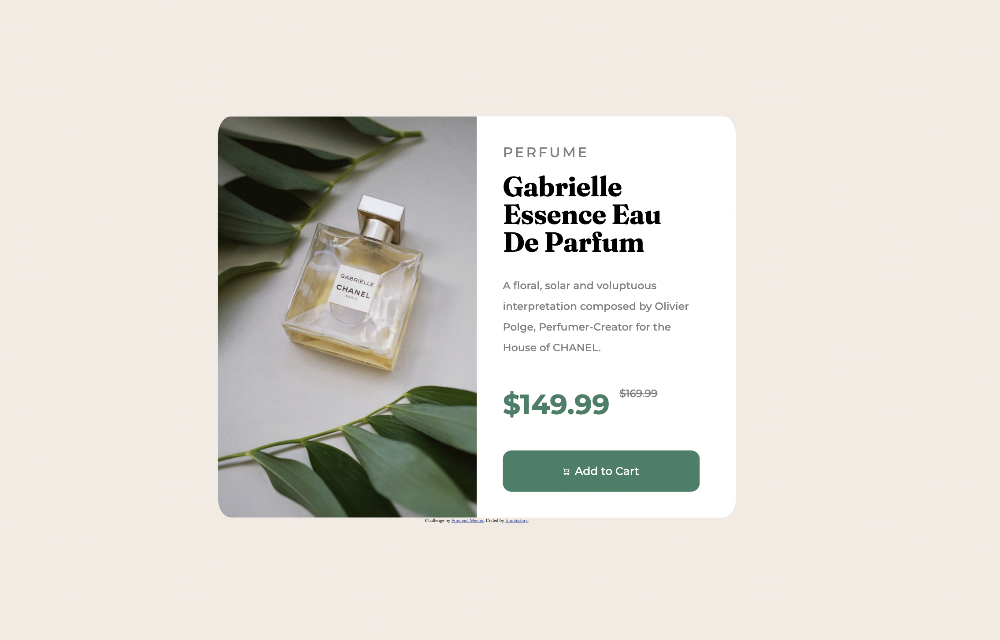
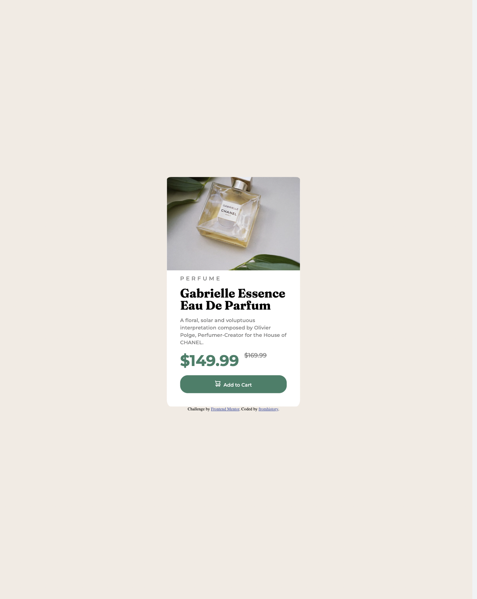

# Frontend Mentor - Product preview card component solution

This is a solution to the [Product preview card component challenge on Frontend Mentor](https://www.frontendmentor.io/challenges/product-preview-card-component-GO7UmttRfa). Frontend Mentor challenges help you improve your coding skills by building realistic projects. 

## Table of contents

- [Overview](#overview)
  - [The challenge](#the-challenge)
  - [Screenshot](#screenshot)
  - [Links](#links)
- [My process](#my-process)
  - [Built with](#built-with)
  - [What I learned](#what-i-learned)
  - [Continued development](#continued-development)

## Overview

### The challenge

Users should be able to:

- View the optimal layout depending on their device's screen size
- See hover and focus states for interactive elements

### Screenshot





### Links

- Solution URL: # Frontend Mentor - Product preview card component solution

This is a solution to the [Product preview card component challenge on Frontend Mentor](https://www.frontendmentor.io/challenges/product-preview-card-component-GO7UmttRfa). Frontend Mentor challenges help you improve your coding skills by building realistic projects. 

## Table of contents

- [Overview](#overview)
  - [The challenge](#the-challenge)
  - [Screenshot](#screenshot)
  - [Links](#links)
- [My process](#my-process)
  - [Built with](#built-with)
  - [What I learned](#what-i-learned)
  - [Continued development](#continued-development)

## Overview

### The challenge

Users should be able to:

- View the optimal layout depending on their device's screen size
- See hover and focus states for interactive elements

### Screenshot


### Links

- Solution URL: https://github.com/fromhistory/product-card
- Live Site URL: https://fromhistory.github.io/product-card/

## My process

### Built with

- Semantic HTML5 markup
- CSS custom properties
- Flexbox
- Mobile-first workflow


**Note: These are just examples. Delete this note and replace the list above with your own choices**

### What I learned

1. I learned how to use images in responsive design. I have two images in html and depending on which one to use I can hide or show their display property:


``` html


```

```css
    .image {
        display: none;
      }
   
    .image_2 {
        display: block;
        border-radius: 5% 0 0 5%;
      }
```

2. I have learned how to use flexbox and change the flexbox direction (row or column) for the responsive design 

``` css
.container {
    background-color: white;
    display: flex;
    flex-direction: column;
    }

  ```
```css
@media (min-width: 1440px){

   .container {
        background-color: hsl(30, 38%, 92%);
        display: flex;
        flex-direction: row;
        text-align: left;
        min-width: 1200px;
    }
}
```


### Continued development

I would still like to practice flexbox and get better at responsive design. 


- Live Site URL: [Add live site URL here](https://your-live-site-url.com)

## My process

### Built with

- Semantic HTML5 markup
- CSS custom properties
- Flexbox
- Mobile-first workflow


**Note: These are just examples. Delete this note and replace the list above with your own choices**

### What I learned

1. I learned how to use images in responsive design. I have two images in html and depending on which one to use I can hide or show their display property:


``` html


```

```css
    .image {
        display: none;
      }
   
    .image_2 {
        display: block;
        border-radius: 5% 0 0 5%;
      }
```

2. I have learned how to use flexbox and change the flexbox direction (row or column) for the responsive design 

``` css
.container {
    background-color: white;
    display: flex;
    flex-direction: column;
    }

  ```
```css
@media (min-width: 1440px){

   .container {
        background-color: hsl(30, 38%, 92%);
        display: flex;
        flex-direction: row;
        text-align: left;
        min-width: 1200px;
    }
}
```


### Continued development

I would still like to practice flexbox and get better at responsive design. 


